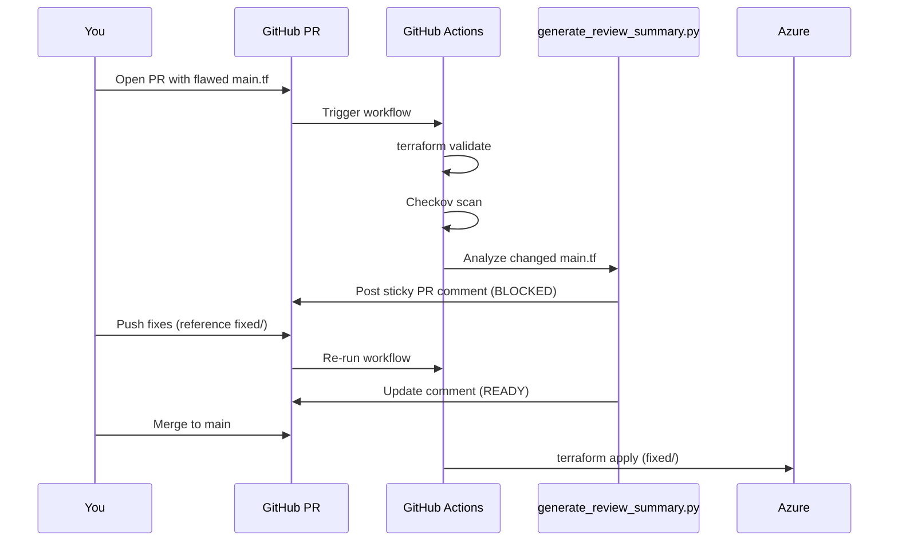

# GitHub + Azure Integration Guide

End-to-end flow for your live demo:

```
Open PR (flawed main.tf) → AI review comment on PR → Fix code → Checks pass → Merge → Azure deploy
```

---

## Architecture



---

## Part 1 — Create GitHub repository

```bash
cd "/Users/idrissop/Documents/Algonquin College/Cloud Development and Operations/Applied Projects/AI Project and Presentation"

git init
git add .
git commit -m "CloudNova: AI-assisted Terraform review and Azure deploy"

# Create repo on GitHub (github.com/new) then:
git remote add origin https://github.com/sopn0001/cloudnova-iac-demo.git
git branch -M main
git push -u origin main
```

---

## Part 2 — Azure setup (one time)

### 2.1 Login and note your IDs

```bash
az login
az account show --query '{subscriptionId:id, tenantId:tenantId}' -o table
```

Save:
- **Subscription ID** → `AZURE_SUBSCRIPTION_ID`
- **Tenant ID** → `AZURE_TENANT_ID`

### 2.2 Create App Registration (OIDC for GitHub)

**Portal:** Microsoft Entra ID → App registrations → **New registration**
- Name: `github-cloudnova-iac`
- Copy **Application (client) ID** → `AZURE_CLIENT_ID`

**Federated credential:** Certificates & secrets → Federated credentials → Add
- Entity: GitHub Actions deploying Azure resources
- Org: `sopn0001`
- Repo: `cloudnova-iac-demo`
- Branch: `main`

### 2.3 Assign Azure permissions

```bash
SUB_ID="<your-subscription-id>"
APP_ID="<your-client-id>"

# Resource group scope (create RG first or let pipeline create it)
az group create --name rg-cloudnova-dev --location canadacentral

az role assignment create \
  --assignee "$APP_ID" \
  --role Contributor \
  --scope "/subscriptions/$SUB_ID/resourceGroups/rg-cloudnova-dev"
```

### 2.4 Generate SSH key for VM deployment

```bash
ssh-keygen -t rsa -b 4096 -f ~/.ssh/cloudnova_github -N ""
cat ~/.ssh/cloudnova_github.pub
```

Copy the **public key** output → `SSH_PUBLIC_KEY` secret.

---

## Part 3 — GitHub secrets and environment

**Repo → Settings → Secrets and variables → Actions → New repository secret**

| Secret | Value |
|--------|-------|
| `AZURE_CLIENT_ID` | App registration client ID |
| `AZURE_TENANT_ID` | Entra tenant ID |
| `AZURE_SUBSCRIPTION_ID` | Azure subscription ID |
| `SSH_PUBLIC_KEY` | Full public key string (`ssh-rsa AAAA...`) |

**Optional:** Settings → Environments → Create `dev` (adds approval gate before deploy).

---

## Part 4 — Live demo flow (presentation)

### Step 1 — Open PR with flawed Terraform

```bash
git checkout main
git pull
git checkout -b demo/flawed-infrastructure

# Optional: touch flawed file to ensure PR triggers workflow
echo "# CloudNova dev environment PR" >> infra/terraform/flawed/main.tf

git add infra/terraform/flawed/main.tf
git commit -m "feat: add CloudNova dev environment Terraform"
git push -u origin demo/flawed-infrastructure
```

On GitHub: **Compare & pull request** → base: `main` ← compare: `demo/flawed-infrastructure`

### Step 2 — Watch pipeline + PR comment

Within ~2 minutes:

| Job | Result on flawed PR |
|-----|---------------------|
| `detect-changes` | Finds `infra/terraform/flawed/main.tf` |
| `validate-terraform` | ✅ Passes (syntax valid) |
| `security-scan` | ⚠️ Checkov warnings |
| `ai-review` | 🚫 Posts comment — **Status: BLOCKED** |
| `deploy-dev` | Does not run on PR |

**PR comment** (posted by `scripts/generate_review_summary.py`):
- 🚫 BLOCKED with critical findings table
- Pattern matches (SSH open, public storage, etc.)
- Checkov excerpt
- Next steps to fix

### Step 3 — Apply the review (push fixes)

**For a full live demo with green checks**, open a second PR that only touches the fixed template:

```bash
git checkout main
git checkout -b demo/apply-review-fixes
echo "# Review applied" >> infra/terraform/fixed/main.tf
git commit -am "fix: apply CloudNova AI review remediations"
git push -u origin demo/apply-review-fixes
```

PR comment will show **✅ READY**. Merge this PR to trigger Azure deploy.

**Alternative (single PR narrative):**
1. Show **BLOCKED** comment on flawed PR
2. Walk through `infra/terraform/fixed/main.tf` fixes live
3. Merge to `main` — deploy always uses `fixed/` (secure resources either way)

### Step 4 — Merge to main → Azure deploy

```bash
# On GitHub: Merge pull request
```

**`deploy-dev` job runs:**
1. Azure OIDC login
2. Creates `rg-cloudnova-dev` + `kv-cloudnova-dev` if missing
3. `terraform plan` + `terraform apply` from `infra/terraform/fixed/`

Verify in Azure Portal → `rg-cloudnova-dev`:
- Storage (private, HTTPS)
- VM `Standard_B2s` (no public IP on fixed template)
- App Service B1
- NSG denies SSH from internet

### Step 5 — Confirm in GitHub

- **Actions** tab → latest `deploy-dev` run → green
- **Step summary** shows resource group and region

---

## Part 5 — Troubleshooting

| Issue | Fix |
|-------|-----|
| No PR comment | Check `pull-requests: write` permission in workflow |
| `Azure Login` fails | Verify federated credential subject matches `repo:USER/REPO:ref:refs/heads/main` |
| `terraform apply` fails on SSH key | Ensure `SSH_PUBLIC_KEY` secret is the full public key string |
| Key Vault access denied | Re-run deploy job — workflow grants Key Vault Secrets User role |
| `ai-review` fails (red X) | Expected on flawed PR — critical issues block merge by design |
| Deploy doesn't run | Only triggers on **push to main** after merge, not on PR |

---

## What each component does

| Component | Role |
|-----------|------|
| `scripts/generate_review_summary.py` | Scans Terraform, posts findings table on PR |
| `marocchino/sticky-pull-request-comment` | Updates same PR comment on each push |
| Checkov | Policy-as-code security scan |
| `ai-review` job | **Blocks PR** if critical issues remain |
| `deploy-dev` job | Deploys `infra/terraform/fixed/` to Azure on merge |

---

## Cleanup after demo

```bash
cd infra/terraform/fixed
# use same -var flags as pipeline
terraform destroy ...

az group delete --name rg-cloudnova-dev --yes
```

---

## Quick reference — demo commands

```bash
# Pre-flight
./scripts/preflight_demo.sh

# Demo PR
git checkout -b demo/flawed-infrastructure
git push -u origin demo/flawed-infrastructure
# → Open PR on GitHub → show comment → merge → show Actions deploy
```
